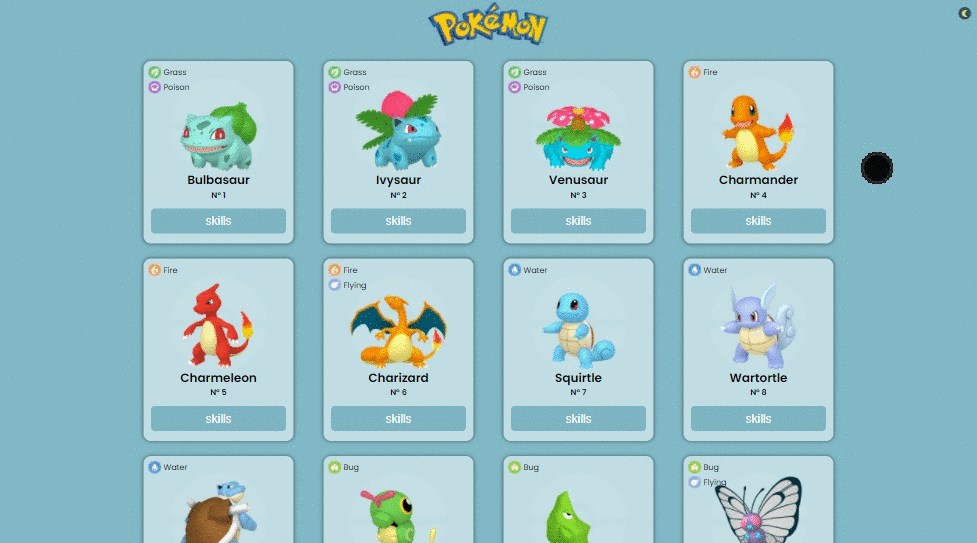

# Pokédex 

Projeto desenvolvido para a prática de React JS.

## Stack utilizada

1 React
* Hooks
  * useState  
  * useEffect 

2 Styled-components
* Para ter maior flexibilidade na escrita do CSS, utilizando renderização condicional dependendo do Thema selecionado.

2 [Axios](https://www.npmjs.com/package/axios)
* Para realizar a conexão com a [Pokeapi](https://pokeapi.co/) e assim poder "pegar" todos os pokemons via GET.

## Demonstração

Demonstração do projeto




## Instalação

Para rodar este e diversos outros projetos direto no seu computador, 
é preciso ter o Git e Nodejs instalado.

Para instalá-los: [git](https://git-scm.com/) e [nodejs](https://nodejs.org/en/). 

Após a instalação:

Abra o prompt de comando ou terminal do vscode e cole o comando:

```bash
git clone https://github.com/DiegoLRamos/pokedex.git

```
Será feito o clone do projeto para o seu computador, após a finalização via prompt de comando ou terminal, acesse a pasta do projeto:

```bash
cd pokedex
```

Agora, digite o comando: 

```bash
npm install / yarn install
```

Aguarde a instalação das dependências e então, digite o comando:

```bash
npm start / yarn start
```

Aguarde a execução e uma nova aba no seu navegador será aberta com o projeto executando. Caso a aba não se abra, acesse:

```bash
http://localhost:3000 
```